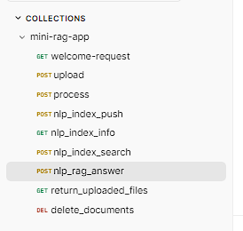

# Rag Application

### This is Rag application for question answering.
- Upload your documents, and retrieve questions with context-aware RAG system that maintains multi-turn conversation history.

- This application supports Semantic cache to reduce LLM API requests expenses and response latency.

- The architecture of this app follows MVC.

# API Endpoints



### upload
- **Description:** Uploads a file to your local machine and store information about it in assets MongoDB collection.

### process
- **Description:** Process the uploaded file and convert it into text chunks then store these chunks in chunks MongoDB collection.

### nlp_index_push
- **Description:** Convert text chunks into text embeddings vectors using Cohere embedding client, then push these embeddings into QDRANT vector database for fast and scalable vector similarity search.

### nlp_index_info
- **Description:** Get info about data in QDRANT vector database.

### nlp_index_search
- **Description:** Input user's query, then searches for similar embeddings in the QDRANT vector database.

### nlp_rag_answer
- **Description:** Input user's query, searches for similar embeddings in the QDRANT vector database, then gives answers using Cohere generation client and shows chat history for each separate project.

### return_uploaded_files
- **Description:** Get info about uploaded files such as file name and file path in your local machine

### delete_documents
- **Description:** Delete multiple uploaded files from your local machine, from assets collection and from chunks collection if these files have chunks.


# Technologies Used

## 1. LLM Providers
- Cohere generation client used for text generation.
- Cohere embedding client used for text embedding to vector database.

## 2. MongoDB (Motor)
Used for:
- Storing documents and their metadata
- Storing documents chunks

## 3. QDRANT vector database
Used for:
- Storing text embeddings in vector database
- Vector search

# Project design
### MVC architecture
A software architectural design pattern that separates an application into three interconnected components—Model (data), View (UI), and Controller (logic)—to separate business logic from user interface, enhancing.
- <b>Models</b>: Manages the application's data, business rules, logic, and database interactions. It directly manages the data, logic, and rules of the application.
- <b>View</b>: Displays the data (Model) to the user and sends user actions to the Controller. It is the user interface, such as HTML/CSS in web apps.
- <b>Controller</b>:  Acts as an intermediary, processing input from the user (via the View), updating the Model, and selecting a view to render. It handles input validation and application logic

## Requirements

- Python 3.8 or later

#### Install Python using MiniConda

1) Download and install MiniConda from [here](https://docs.anaconda.com/free/miniconda/#quick-command-line-install)
2) Create a new environment using the following command:
```bash
$ conda create -n mini-rag python=3.8
```
3) Activate the environment:
```bash
$ conda activate mini-rag-app
```

## Installation

### Install the required packages

```bash
$ pip install -r requirements.txt
```

### Setup the environment variables

```bash
$ cp .env.example .env
```

Set your environment variables in the `.env` file. Like `OPENAI_API_KEY` value.

## Run Docker Compose Services

```bash
$ cd docker
$ cp .env.example .env
```

- update `.env` with your credentials


```bash
$ cd docker
$ sudo docker compose up -d
```

## Run the FastAPI server

```bash
$ uvicorn main:app --reload --host 0.0.0.0 --port 5000
```
